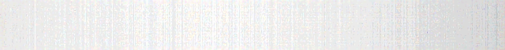

# Faster-Raspiraw

A fast camera capturing tool for lab use.

This app is designed to capture the very moment of pitch variation in a novel design drone. It functions as directly receving raw *Bayer* format data from CSI sensors on the Raspberry Pi.

Note that: The register sets for OV5647 and IMX219 are often under NDA, which means that support can not be offered over their contents without breaking those NDAs. Anything added here by RPF/RPT has to be demonstrable as already being in the public domain, or from 3rd parties having reverse engineered how the firmware is working (e.g. by listening to the I2C communications).

Supported sensors:

	adv7282m
	imx219
	ov5647

## Release note

- Utilized `mmap()`, `memcpy()` to perform raw data saving.
- Configured `/dev/shm` as storage buffer.
- Multithreading to perform copy from `/dev/shm` to user designated dir, with `MAX_THREADS` num of workers as the thread pool.
- Efficient copying via `open_shm()` and `unlink_shm()`.
- Able to archive `99.1%` valid data rate at `660` fps with `640x480`, and perform capturing time longer than `50`s with copying.
- Used `CMake` for project management.

## Usage options

Table of contents:

	$ faster-raspiraw

	faster-raspiraw Camera App 0.0.4

	-?, --help	: This help information
	-md, --mode	: Set sensor mode <mode>
	-hf, --hflip	: Set horizontal flip
	-vf, --vflip	: Set vertical flip
	-e, --ss	: Set the sensor exposure time (not calibrated units)
	-g, --gain	: Set the sensor gain code (not calibrated units)
	-o, --output	: Set the output filename
	-hd, --header	: Write the BRCM header to the output file
	-t, --timeout	: Time (in ms) before shutting down (if not specified, set to 5s)
	-sr, --saverate	: Save every Nth frame
	-b, --bitdepth	: Set output raw bit depth (8, 10, 12 or 16, if not specified, set to sensor native)
	-c, --cameranum	: Set camera number to use (0=CAM0, 1=CAM1).
	-eus, --expus	: Set the sensor exposure time in micro seconds.
	-y, --i2c	: Set the I2C bus to use.
	-r, --regs	: Change (current mode) regs
	-hi, --hinc	: Set horizontal odd/even inc reg
	-vi, --vinc	: Set vertical odd/even inc reg
	-f, --fps	: Set framerate regs
	-w, --width	: Set current mode width
	-h, --height	: Set current mode height
	-tp, --top	: Set current mode top
	-hd0, --header0	: Sets filename to write the BRCM header to
	-ts, --tstamps	: Sets filename to write timestamps to
	-emp, --empty	: Write empty output files
	$


## Dependencies

Tested on 32-bit Debian 10, recommend to use 32-bit OS to compliant with userland_cameraraw.
```
git clone --recurse-submodules https://github.com/yichengleo/faster-raspiraw.git
```
### WiringPi
WiringPi is a library that enables fast operations on GPIO pins. It must be installed before running `faster-raspiraw`. You can install WiringPi using one of the following methods:
1. Install WiringPi
- Install via Apt Package Manager

```
sudo apt-get install wiringpi
```
- Install from Source
```
cd WiringPi
./build
```
2. Verify WiringPi Installation:
```
gpio -v
```

### Userland_cameraraw
Raspberry Pi's userland libraries, which include components like the camera interface `libmmal`.

```
cd userland-rawcam
sudo ./buildme
```

## Instructions
### Camera I2C
For initial setup and after each reboot, the I2C interface for the camera must be registered. This step requires elevated privileges because GPIO configuration is involved. 

```
cd ./faster-raspiraw
sudo chmod +x *.sh
sudo ./camera_i2c
```

### Faster-Raspiraw
#### Using pre-build binary
The binary is stored in `./bin/faster-raspiraw`. 
```
cd ./faster-raspiraw
./run.sh
```
Note that the default number of threads for moving the raw data is set as `4`. If more threads are needed, please change the `MAX_THREADS` in `/include/raspiraw.h` and compile.
#### Compile
```
mkdir build && cd build
cmake ..
make
./faster-raspiraw -md 7 -t 1000 -ts /dev/shm/tstamps.csv -h 64 -w 640 --vinc 1F --fps 660  -sr 1 -o /dev/shm/out.%04d.raw 2>/dev/null
```

This command captures video from imx219 camera on CSI-2 interface:
* based on 640x480 mode (-md 7)
* captures for 1s (-t 1000)
* stores &micro;s timestamps in file tstamps.csv (-ts)
* sets frame capture height to 64 (-h 64)
* sets frame capture width to 640 (-w 640)
* increases line skipping to 1 and 15 instead of 3 and 5. Results in doubling vertical covered area (--vinc 1F, sum 8 vs 16). 1F shows colors (see below), 3D result is pale
* requests 660 fps (--fps 660)
* sets saverate to 1 (save all frames)
* outputs in "/dev/shm" ramdisk files starting with "out.0001.raw"
* redirects standard error output (lots of mmal messages) to /dev/null (2>/dev/null)


### Dcraw
Dcraw converts the Bayer format `raw` data to `ppm`.

On Buster:
```
sudo apt-get install libjasper-dev libjpeg8-dev gettext liblcms2-dev
```
On Bullseye:
```
sudo apt-get install libjasper-dev libjpeg9-dev gettext liblcms2-dev
```
#### Usage
The pre-built `dcraw` executable is located in the `./bin` folder for your convenience.

#### Multi-Process Conversion Script
To process raw files in parallel, you can use the provided multi-process conversion script. The script supports default paths and allows for custom input/output paths.
```
# Default Usage (input: /dev/shm, output: current directory)
./process.sh

# Specify only the input folder (output defaults to current directory)
./process.sh <input_folder>

# Specify both input and output folders
./process.sh <input_folder> <output_folder>
```
The script will:

1. Use `dcraw` to process all `.raw` files in the specified input folder.
2. Handle multi-threaded processing for efficiency.
Relocate the generated output files (e.g., `.ppm`) to the specified output folder.
3. Ensure you have the required permissions if working with files in system directories like /dev/shm.

#### Troubleshooting: Compilation Errors

```
/usr/include/jpeglib.h:29:10: fatal error: jconfig.h: No such file or directory
   29 | #include "jconfig.h"            /* widely used configuration options */
      |          ^~~~~~~~~~~
compilation terminated.
make[2]: *** [CMakeFiles/faster-raspiraw_lib.dir/build.make:76: CMakeFiles/faster-raspiraw_lib.dir/src/dcraw.c.o] Error 1
make[1]: *** [CMakeFiles/Makefile2:78: CMakeFiles/faster-raspiraw_lib.dir/all] Error 2
```

Need to manually softlink the header file to the system include folder
```
sudo ln -s /usr/include/arm-linux-gnueabihf/jconfig.h /usr/include/jconfig.h
```

## Images
It is not surprising to get a blurry picture like the following:

### Explanation:
The incredibly fast FPS (frames per second) results in uncommonly short exposure intervals. This means the ambient light conditions are insufficient for the camera sensor to capture enough contrast in the surroundings, leading to blurred images.

### Solution: Enhanced Lighting
To address this, I used two 50-watt LED light sources, as shown below:


Below is the test platform for a drone's novel hinge. With the LED lights powered on, the captured images are clear and detailed:

 

### Future Optimization: External Global Shutter and Light Synchronization
Further improvements can be achieved by using an external global shutter with the Raspberry Pi v1 camera. By controlling the light source with a Power MOSFET and a timer, precise PWM signals can be generated to create microsecond-length bright flashes. This would allow for even higher FPS while maintaining clear image capture.

### Further Reference:
https://github.com/Hermann-SW/Raspberry_v1_camera_global_external_shutter?tab=readme-ov-file

https://stamm-wilbrandt.de/en/Raspberry_camera.html

https://forums.raspberrypi.com/viewtopic.php?f=43&t=212518&p=1310445#p1310445
